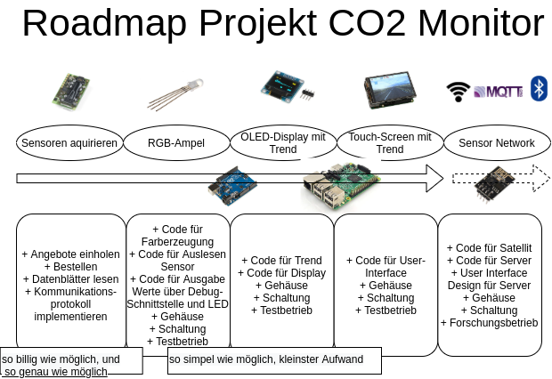
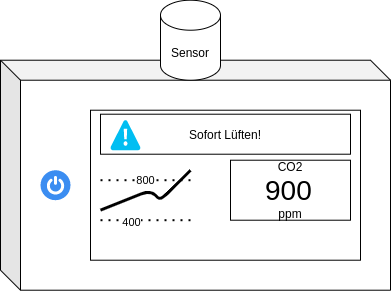
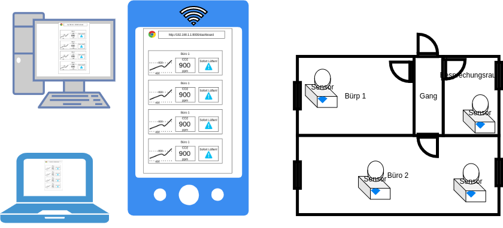

# co2-monitor
Monitoring CO2 in rooms for air quality improvement

## We live inside
Our homes and workplaces are filled with CO2 from our lungs. The only way to get rid of all the excessive CO2 is by regular ventilation. But how do you know if it is working? The answer is simple: **science**.

## Vision

### Standalone Device

A device with a screen, to show a CO2 trend.

### Sensor Network

To detect variances and dynamics in room CO2 concentration, multiple sensors are needed.

## NEWS
- sensors have arrived

## TODO / Progress

### Team
- ME
- SH
- AH
- ... (anybody is welcome)

## Outline

### Sensor
- NDIR: Sensirion SCD30 (they even provide a nice example using bluetooth: https://developer.sensirion.com/tutorials/create-your-own-co2-monitor/)

### Hardware
- RPi, Arduino, ESP8266, NodeMCU,...
- Arduino Uno

### Software
- C++, Python
- RGB-LED output
- OLED output
- sensor input

### Housing
- 3D printed

### Testing
- guerilla

### UX
- nobody will monitor the screen all the time. Exploring other means of communication (audio, visual, haptic)
- fun housing that looks like a tiny house. windows open with servo(s). could use i2c servo driver

## Info
(all images created with draw.io)
